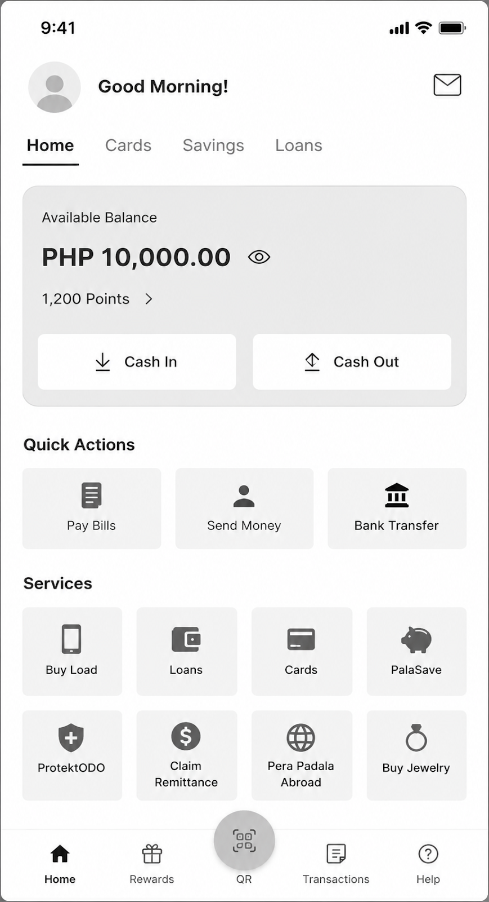
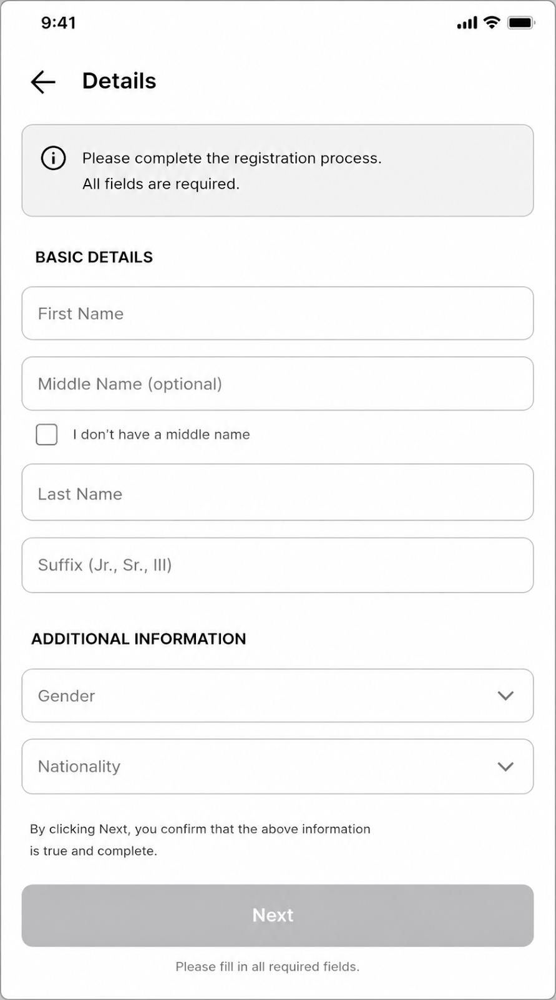
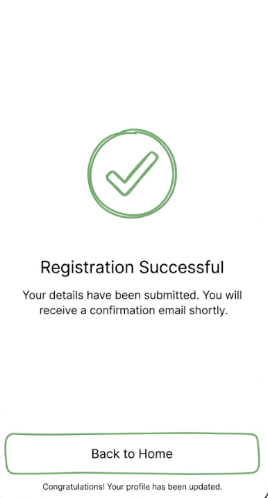

# 🔰 Flutter Guide

For Mobile Development Readiness  
_Created by Mr. James Reuben Gruta | Given on 08/14/2026_

## What is Flutter SDK?

Determine the pros and cons of Flutter SDK vs Native Mobile Development.

Additional Thoughts:

1. What do you think is the core advantage why PalawanPay Mobile app uses Flutter instead of native development?

## What is Dart Language?

- Know the syntax of Dart language (conditions, variable declarations, classes, abstract classes, functions, async, etc and other fundamentals)
- What is null safety?

Additional Thoughts:

1. How does Dart differ from Javascript and Typescript, what are the similarities you have observed?

## 🎯 Activity 1

Practice basic dart syntax:

1. Create a basic data model consisting of (string, int, bool).
2. Ensure immutability (use final keywords)
3. Add copyWith function. (to make updating easier)
4. Override == and hashcode (for model comparison)
5. Create a function that accepts the model as parameter then prints the toString function.
6. In your void main, create 5 data models, store it in an array.
7. Iterate over the array and call the function. (should print toString() 5x)
8. In your void main after iteration block, compare index 1 and index 2. Index 3 to index 5. Index 4 to index 4. (this is to test hashcode)
9. Use copyWith function to modify the int value. Print the results after. (for testing copyWith)

---

## What is a Widget?

- Whats the difference between Stateless and Stateful Widget?
- When to use Stateless and Stateful?
- What is the Widget lifecycle?
- Understand the Widget Tree and its importance.
- What are the types of Widget?
- How to add properties to a widget?

## 🎯 Activity 2

Recreate the widget layout.
Guidelines:

- Think of Lego building blocks. Create small, medium, large size widgets to strategically implement this. Utilize this for reusability
- Clue: its a combination of Scaffold, SingleChildScrollView, SafeArea, Row, Column, Text, Bottom Navigation Bar, etc.
- Make it scrollable.
- You can use alternate text and icons.
- **No need to be functional.**

<p align="center">
  
</p>

---

## What is State Management?

- Why is state management important?
- How does state management separate business logic from UI?

## 🎯 Activity 3

Create a basic form.

- Create datamodel for the details
- Use Textformfield for the text fields
- Use dropdown fields for Gender and Nationality
- Update the datamodel value with the form data using onchange listener and setState
- Next button only enables if all fields are complete. Utilize StatefulWidget and datamodel for logic.
- Ignore the back button functionality
- Ignore the checkbox

<p align="center">
  
</p>

---

## What is a BLOC?

- Why do we need BLOC for proper state management?
- What are the primary ingredients of BLOC state management?
- Explain Bloc states, events, repository and listeners
- What is Cubit? When do we use it?

## Local Storage

- Why do we need to use sharedpreference?
- How to use sharedpreferences?
- What is Flutter securestorage?

Additional thoughts:

1. Why do you think Palawan App needs to use Flutter Secure Storage? Why not just use sharedpreferences?

## 🎯 Activity 4

- Create a helper class for saving and retrieving SharePreference data
- Should contain 2 functions, **saveSharedPreference** & **readSharedPreference**.
- Test the two functions by storing a value and then retrieving them after.

- Create a basic screen with a button and text. Text will have value from **readSharedPreferences**. Only display the text if theres a value.
- When the button is pressed, call the **saveSharedPreference** function to save a default value.

**Test:**

- Initial run, text not visible and only button.
- Presses the button.
- Close and Rereun the application. Value must persist.
- Uninstall and reinstall the application. Value should be empty again.

---

## Navigation and Routing

- When to use the following: Navigator.push, Navigator.pop, Navigator.pushNamed,Navigator.pushReplacementNamed, and other Navigator functions?
- Difference between Navigator.of(context).pop() vs Navigator.pop(context)
- What are named routes?

## 🎯 Activity 5

- Add welcome admin screen. Start button should navigate to your form screen.
- Add a registration successful screen and failed screen. Back to home goes back to welcome admin.
- Reuse the UI you already built earlier.
- Reuse data model for details containing firstname middlename, lastname, suffix, gender, nationality
- Create bloc class, bloc event and bloc state for storing details using sharedpreferences. Utilize the helper function you created in activity 4.
- Refactor the next button. Pass the datamodel to bloc event when button is pressed.
- In your bloc class, use int randomizer, if the number is even call the sharedpreferences and save the data then emit success. If the number is odd, emit failure.
- Integrate the bloclistener to the details screen. If success,screen jumps to success page. If not, go to failed screen (try again).
- Use navigator.pop for backbutton (goes back to welcome)

<p align="center">
  
  
  <br>
  
  
</p>

---

## Network & API

- What is http package?
- What is JSON? (be familiar with JSON format)
- What is JSON serialization?
- Whats the difference between POST and GET http methods

## 🎯 Activity 6

- Remake your first activity (data model) by creating a new data model to handle this json response.

```json
{
  "account": {
    "accountNumber": "000123456789",
    "accountName": "Juan Dela Cruz",
    "accountType": "Savings",
    "currency": "PHP",
    "balance": 10000.0,
    "availableBalance": 9500.0,
    "status": "Active",
    "openedDate": "2025-01-15"
  },
  "bank": {
    "bankName": "Sample Bank",
    "branch": "Main Branch",
    "branchCode": "0001"
  },
  "customer": {
    "customerId": "CUST-00123",
    "firstName": "Juan",
    "middleName": "Santos",
    "lastName": "Dela Cruz"
  },
  "features": {
    "onlineBanking": true,
    "mobileBanking": true,
    "cashIn": true,
    "cashOut": true
  }
}
```

- Add fromJson and toJson functions for serializing and deserializing json data.
- Use https://jsoneditoronline.org to easily view the JSON structure above

## Post Activity Insights

- To understand JSON format and why we use it
- What, why and where we to use JSON serialization and deserialization

## 🎯 Activity 7 (Option A)
- Visit https://scryfall.com/docs/api/cards/search, use the following apis to display list and display of card details. https://api.scryfall.com/cards/search?order=name&q=robot
- This API returns list of cards and their images.
- Use http package to call these API
- Create a model for the json response
- Create a search form where you can type keywords. Soft Keyboard’s “go” “search” “ok”, etc should trigger search bloc event.
- Create your own widget to list cards (name, images, and other relevant data), make sure to make it reusable
- Use bloc listener to display the list of cards or if they are empty.
- Upon clicking on item from the list, display detailed view of the card details
- Utilize bloc class, events and state.
- Expected to have 2 screens. (main list screen & details screen)
- Test: If i enter the keyword “code”, cards with code in the name should be displayed on a list. Tapping an item will display the card details

## 🎯 Activity 7 (Option B)
- Visit https://pokeapi.co, use the following two apis to display list and display pokemon details. For list use: https://pokeapi.co/api/v2/pokemon?limit=10&offset=0
- For details use https://pokeapi.co/api/v2/pokemon/ditto
- Use http package to call these API
- Create a model for the json response
- Create your own widget to list pokemon, make sure to make it reusable. Use an infinite scrolling concept to append list of pokemons per end of scrolling. Adjust the offset parameter accordingly to the requirements.
- Upon clicking on item from the list, display detailed view of the pokemon
- Utilize bloc class, events and state.
- Expected to have 2 screens. (main list screen & details screen)
- Test: Should initially display 10 pokemon from the list. Upon scrolling another 10 will be added. Tapping an item from the list displays detailed view


